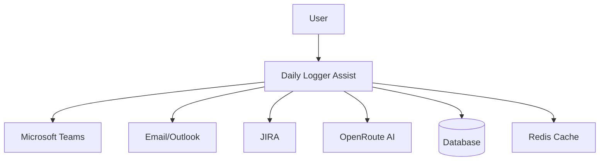
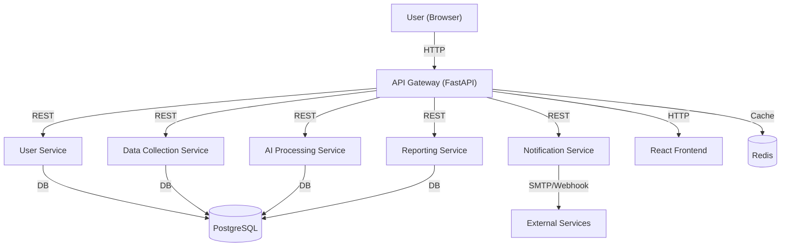
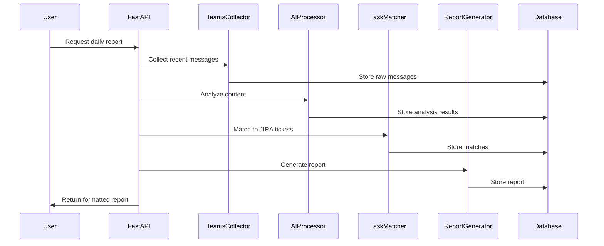
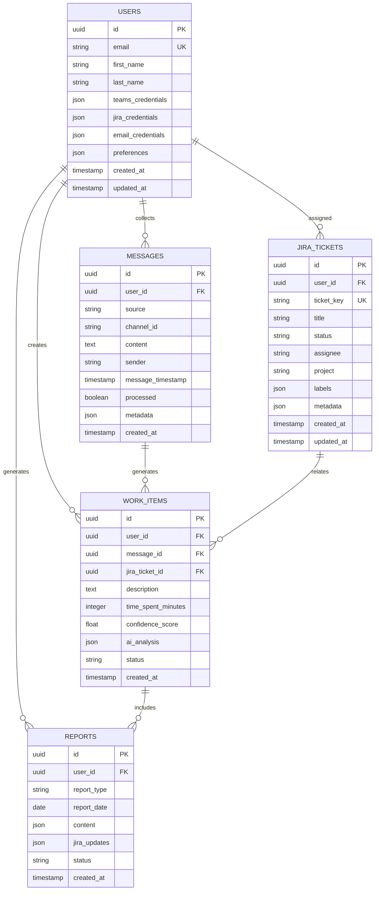
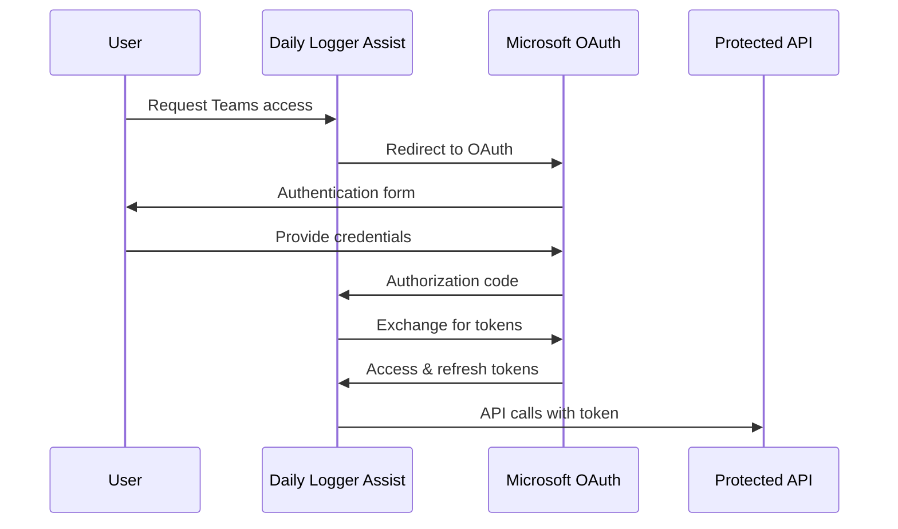
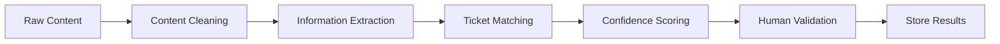
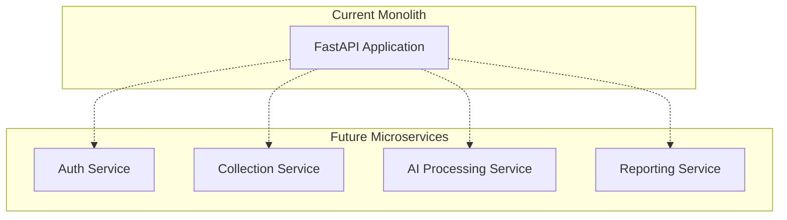

# Software Design Document (SDD)
## Daily Logger Assist Application

**Version:** 2.0  
**Date:** July 2025  
**Status:** Production-Ready  

---

## Table of Contents

1. [Introduction](#1-introduction)
2. [System Overview](#2-system-overview)
3. [Microservices Architecture](#3-microservices-architecture)
4. [Component Design](#4-component-design)
5. [Database Design](#5-database-design)
6. [API Design](#6-api-design)
7. [Security Design](#7-security-design)
8. [AI Integration Design](#8-ai-integration-design)
9. [User Interface Design](#9-user-interface-design)
10. [Performance Considerations](#10-performance-considerations)
11. [Scalability Design](#11-scalability-design)
12. [Error Handling](#12-error-handling)
13. [Roadmap & Future Plans](#13-roadmap--future-plans)

---

## 1. Introduction

### 1.1 Purpose
This document describes the software design for the Daily Logger Assist application, an intelligent system that automates the creation of daily status updates for JIRA tickets by parsing communications from Microsoft Teams and email.

### 1.2 Scope
The application encompasses:
- Multi-source data collection (Teams, Email, JIRA)
- AI-powered content analysis and task matching
- Automated report generation
- Weekly work distribution planning
- RESTful API for integration

### 1.3 Definitions and Acronyms
- **DLA**: Daily Logger Assist
- **AI**: Artificial Intelligence
- **API**: Application Programming Interface
- **JIRA**: Atlassian project management tool
- **OAuth**: Open Authorization
- **REST**: Representational State Transfer

---

## 2. System Overview

### 2.1 System Purpose
Daily Logger Assist automates the tedious process of tracking and reporting daily work activities by:
- Automatically collecting work-related communications
- Using AI to extract relevant project information
- Matching activities to JIRA tickets
- Generating structured daily/weekly reports
- Distributing work across an 8-hour daily schedule

### 2.2 Key Features
- **Intelligent Data Collection**: Automated parsing of Teams messages and emails
- **AI-Powered Analysis**: Content categorization and task identification
- **JIRA Integration**: Automatic ticket matching and update generation
- **Time Management**: 8-hour daily work distribution
- **Reporting**: Daily and weekly status reports
- **API Access**: RESTful endpoints for all functionality

### 2.3 System Context



---

## 3. Microservices Architecture

### 3.1 Overview
The system is now split into independent microservices, each responsible for a specific domain. All services communicate via REST APIs, with a central API Gateway handling authentication, routing, and rate limiting.

### 3.2 Service Breakdown
| Service                  | Responsibility                                 | Port  |
|--------------------------|------------------------------------------------|-------|
| gateway-service          | API Gateway, routing, auth, rate limiting      | 8000  |
| user-service             | Authentication, user management                | 8001  |
| data-collection-service  | Teams, Email, JIRA data collection             | 8002  |
| ai-processing-service    | AI content analysis, task matching             | 8003  |
| reporting-service        | Report generation, templates                   | 8004  |
| notification-service     | Email alerts, webhooks                         | 8005  |
| frontend-service         | React frontend (served via Nginx/Node)         | 3000  |

### 3.3 Inter-Service Communication
- **API Gateway**: All client requests go through the gateway
- **REST APIs**: Services communicate via HTTP/JSON
- **Redis**: Used for session management, rate limiting, and message queue
- **Docker Compose**: Orchestrates all services for local/dev deployment

### 3.4 Architecture Diagram


### 3.5 Technology Stack (Updated)
| Layer         | Technology                        |
|---------------|-----------------------------------|
| Frontend      | React, TypeScript, MUI, Redux     |
| API Gateway   | FastAPI, SlowAPI, httpx           |
| Microservices | FastAPI, SQLAlchemy, Pydantic     |
| Database      | PostgreSQL                        |
| Caching/Queue | Redis                             |
| Container     | Docker, Docker Compose            |
| Monitoring    | Prometheus, Grafana, Sentry       |
| Auth          | JWT (stateless), Redis sessions   |

---

## 4. Component Design

### 4.1 Core Components

#### 4.1.1 Data Collectors

**Teams Collector**
```python
class TeamsCollector:
    """Collects messages from Microsoft Teams channels"""
    
    async def collect_messages(self, channels: List[str], since: datetime) -> List[Message]
    async def authenticate(self, credentials: TeamsCredentials) -> bool
    async def get_user_channels(self) -> List[Channel]
```

**Email Collector**
```python
class EmailCollector:
    """Collects emails from Exchange/Outlook"""
    
    async def collect_emails(self, folders: List[str], since: datetime) -> List[Email]
    async def authenticate(self, credentials: EmailCredentials) -> bool
    async def get_folders(self) -> List[Folder]
```

**JIRA Collector**
```python
class JIRACollector:
    """Manages JIRA ticket information"""
    
    async def get_user_tickets(self, user_id: str) -> List[JIRATicket]
    async def update_ticket(self, ticket_key: str, update: TicketUpdate) -> bool
    async def get_projects(self) -> List[Project]
```

#### 4.1.2 AI Processing Engine

**Content Analyzer**
```python
class ContentAnalyzer:
    """AI-powered content analysis"""
    
    async def extract_work_info(self, content: str) -> WorkInfo
    async def categorize_content(self, content: str) -> ContentCategory
    async def estimate_time_spent(self, content: str) -> TimeEstimate
```

**Task Matcher**
```python
class TaskMatcher:
    """Matches content to JIRA tickets using AI"""
    
    async def match_to_tickets(self, work_info: WorkInfo, tickets: List[JIRATicket]) -> List[TicketMatch]
    async def calculate_confidence(self, match: TicketMatch) -> float
```

#### 4.1.3 Report Generators

**Daily Report Generator**
```python
class DailyReportGenerator:
    """Generates daily status reports"""
    
    async def generate_report(self, user_id: str, date: date) -> DailyReport
    async def format_for_jira(self, report: DailyReport) -> str
```

**Weekly Report Generator**
```python
class WeeklyReportGenerator:
    """Generates weekly work distribution"""
    
    async def generate_weekly_distribution(self, user_id: str, week: date) -> WeeklyDistribution
    async def distribute_8_hour_days(self, work_items: List[WorkItem]) -> List[DailySchedule]
```

### 4.2 Component Interactions



---

## 5. Database Design

### 5.1 Entity Relationship Diagram



### 5.2 Database Schema Details

#### 5.2.1 Users Table
- **Primary Key**: UUID for security
- **Credentials**: Encrypted JSON storage for API tokens
- **Preferences**: User-specific configuration
- **Audit Fields**: Created/Updated timestamps

#### 5.2.2 Messages Table
- **Source Tracking**: Teams, Email, or Manual entry
- **Content Storage**: Full message content for AI analysis
- **Processing Status**: Tracks analysis completion
- **Metadata**: Source-specific information (channel, thread, etc.)

#### 5.2.3 Work Items Table
- **AI Analysis**: Stores complete AI processing results
- **Confidence Scoring**: Quality metric for matches
- **Time Tracking**: Estimated time spent on tasks
- **Status Tracking**: Processing and approval status

### 5.3 Data Access Patterns

```python
class BaseRepository:
    """Base repository with common operations"""
    
    async def create(self, entity: BaseModel) -> BaseModel
    async def get_by_id(self, entity_id: UUID) -> Optional[BaseModel]
    async def update(self, entity_id: UUID, updates: dict) -> BaseModel
    async def delete(self, entity_id: UUID) -> bool
    async def list_by_criteria(self, criteria: dict) -> List[BaseModel]

class WorkItemRepository(BaseRepository):
    """Specialized repository for work items"""
    
    async def get_by_date_range(self, user_id: UUID, start: date, end: date) -> List[WorkItem]
    async def get_unmatched_items(self, user_id: UUID) -> List[WorkItem]
    async def get_by_confidence_threshold(self, threshold: float) -> List[WorkItem]
```

---

## 6. API Design

### 6.1 RESTful Endpoints

#### 6.1.1 Authentication Endpoints
```
POST   /api/v1/auth/teams/login          # Initiate Teams OAuth
GET    /api/v1/auth/teams/callback       # Teams OAuth callback
POST   /api/v1/auth/jira/login           # JIRA authentication
POST   /api/v1/auth/email/login          # Email authentication
GET    /api/v1/auth/status               # Authentication status
POST   /api/v1/auth/refresh              # Refresh tokens
POST   /api/v1/auth/logout               # Logout user
```

#### 6.1.2 Data Collection Endpoints
```
POST   /api/v1/data/teams/sync           # Sync Teams messages
POST   /api/v1/data/email/sync           # Sync emails
POST   /api/v1/data/jira/sync            # Sync JIRA tickets
GET    /api/v1/data/sync/status          # Sync status
POST   /api/v1/data/process              # Process collected data
```

#### 6.1.3 Work Items Endpoints
```
GET    /api/v1/work-items                # List work items
POST   /api/v1/work-items                # Create work item
GET    /api/v1/work-items/{id}           # Get work item
PUT    /api/v1/work-items/{id}           # Update work item
DELETE /api/v1/work-items/{id}           # Delete work item
POST   /api/v1/work-items/bulk-process   # Bulk process items
```

#### 6.1.4 Reports Endpoints
```
GET    /api/v1/reports/daily/{date}      # Get daily report
GET    /api/v1/reports/weekly/{week}     # Get weekly report
POST   /api/v1/reports/generate          # Generate new report
POST   /api/v1/reports/send-to-jira      # Send updates to JIRA
GET    /api/v1/reports/templates         # Report templates
```

### 6.2 Request/Response Schemas

#### 6.2.1 Work Item Schema
```python
class WorkItemCreate(BaseModel):
    message_id: Optional[UUID]
    jira_ticket_id: Optional[UUID]
    description: str
    time_spent_minutes: int
    confidence_score: Optional[float] = None

class WorkItemResponse(BaseModel):
    id: UUID
    user_id: UUID
    description: str
    time_spent_minutes: int
    confidence_score: float
    status: str
    ai_analysis: Optional[dict]
    created_at: datetime
    
    class Config:
        from_attributes = True
```

#### 6.2.2 Report Schema
```python
class DailyReportResponse(BaseModel):
    id: UUID
    user_id: UUID
    report_date: date
    total_time_minutes: int
    work_items: List[WorkItemSummary]
    jira_updates: List[JIRAUpdate]
    created_at: datetime

class WeeklyDistribution(BaseModel):
    week_start: date
    daily_schedules: List[DailySchedule]
    total_hours: float
    distribution_quality: float
```

### 6.3 Error Handling

```python
class APIError(Exception):
    """Base API error"""
    def __init__(self, message: str, status_code: int = 500):
        self.message = message
        self.status_code = status_code

class ValidationError(APIError):
    """Validation error"""
    def __init__(self, message: str):
        super().__init__(message, 422)

class AuthenticationError(APIError):
    """Authentication error"""
    def __init__(self, message: str = "Authentication required"):
        super().__init__(message, 401)
```

---

## 7. Security Design

### 7.1 Authentication & Authorization

#### 7.1.1 OAuth 2.0 Flow


#### 7.1.2 Token Management
- **Access Tokens**: Short-lived (30 minutes)
- **Refresh Tokens**: Long-lived (7 days)
- **Automatic Refresh**: Transparent token renewal
- **Secure Storage**: Encrypted token storage

### 7.2 Data Security

#### 7.2.1 Encryption
- **At Rest**: Database encryption for sensitive fields
- **In Transit**: TLS 1.3 for all communications
- **API Keys**: Environment variable storage
- **Credentials**: AES-256 encryption

#### 7.2.2 Access Control
```python
class SecurityManager:
    """Manages security policies"""
    
    async def verify_user_access(self, user_id: UUID, resource_id: UUID) -> bool
    async def encrypt_credentials(self, credentials: dict) -> str
    async def decrypt_credentials(self, encrypted: str) -> dict
    async def audit_access(self, user_id: UUID, action: str, resource: str) -> None
```

### 7.3 Rate Limiting

```python
class RateLimiter:
    """API rate limiting"""
    
    limits = {
        "default": "100/hour",
        "ai_processing": "50/hour",
        "data_sync": "20/hour"
    }
```

---

## 8. AI Integration Design

### 8.1 OpenRoute Integration

#### 8.1.1 AI Service Architecture
```python
class AIService:
    """OpenRoute AI integration"""
    
    def __init__(self, api_key: str, base_url: str):
        self.client = openai.OpenAI(
            base_url=base_url,
            api_key=api_key
        )
    
    async def analyze_content(self, content: str, context: str) -> AIAnalysis
    async def match_to_tickets(self, content: str, tickets: List[dict]) -> List[TicketMatch]
    async def generate_summary(self, work_items: List[dict]) -> str
```

#### 8.1.2 Prompt Engineering
```python
class PromptTemplates:
    """AI prompt templates"""
    
    EXTRACT_WORK_INFO = """
    Analyze the following communication and extract work-related information:
    
    Content: {content}
    
    Extract:
    1. Project/task mentions
    2. Time indicators
    3. Technical details
    4. Action items
    
    Format response as JSON with confidence scores.
    """
    
    MATCH_JIRA_TICKETS = """
    Match the work description to relevant JIRA tickets:
    
    Work Description: {description}
    Available Tickets: {tickets}
    
    Return the best matches with confidence scores.
    """
```

### 8.2 AI Processing Pipeline



### 8.3 Quality Assurance

#### 8.3.1 Confidence Scoring
- **High Confidence**: > 0.8 (Auto-approve)
- **Medium Confidence**: 0.5 - 0.8 (Human review)
- **Low Confidence**: < 0.5 (Manual processing)

#### 8.3.2 Validation Mechanisms
```python
class AIValidator:
    """Validates AI processing results"""
    
    async def validate_extraction(self, result: AIAnalysis) -> ValidationResult
    async def validate_ticket_match(self, match: TicketMatch) -> ValidationResult
    async def flag_for_review(self, item: WorkItem, reason: str) -> None
```

---

## 9. User Interface Design (Updated)

### 9.1 React Frontend Features
- **Authentication**: Login, register, password reset, profile
- **Dashboard**: Daily/weekly overview, quick actions, notifications
- **Work Items**: CRUD, time tracking, categories, search/filter
- **Reports**: Generation, templates, export (PDF/CSV), analytics
- **Integrations**: Teams, Email, JIRA configuration
- **Settings**: Preferences, theme, data export
- **AI Insights**: Content analysis, task suggestions, smart categorization

### 9.2 Frontend Structure
- `src/components/`: Reusable UI components
- `src/pages/`: Route-based pages (Dashboard, WorkItems, Reports, Auth, Settings)
- `src/store/`: Redux Toolkit state management
- `src/services/`: API clients
- `src/types/`: TypeScript types
- `src/utils/`: Utility functions
- `src/hooks/`: Custom React hooks

---

## 10. Performance Considerations

### 10.1 Caching Strategy

```python
class CacheManager:
    """Redis-based caching"""
    
    cache_ttl = {
        "user_sessions": 3600,      # 1 hour
        "jira_tickets": 1800,       # 30 minutes
        "ai_analysis": 86400,       # 24 hours
        "reports": 3600             # 1 hour
    }
```

### 10.2 Database Optimization

- **Indexing**: Strategic indexes on query columns
- **Connection Pooling**: Efficient database connections
- **Query Optimization**: Minimized N+1 queries
- **Pagination**: Large result set handling

### 10.3 Background Processing

```python
@celery.task(bind=True, max_retries=3)
def process_messages_task(self, user_id: str, message_ids: List[str]):
    """Background message processing"""
    try:
        # Process messages asynchronously
        return process_messages(user_id, message_ids)
    except Exception as exc:
        self.retry(countdown=60, exc=exc)
```

---

## 11. Scalability Design

### 11.1 Horizontal Scaling

- **Stateless Design**: No server-side session storage
- **Load Balancing**: Multiple API server instances
- **Database Scaling**: Read replicas and sharding
- **Cache Distribution**: Redis cluster

### 11.2 Microservices Evolution



### 11.3 Resource Management

```python
class ResourceManager:
    """Manages system resources"""
    
    async def monitor_memory_usage(self) -> float
    async def scale_workers(self, load: float) -> None
    async def cleanup_old_data(self, retention_days: int) -> None
```

---

## 12. Error Handling

### 12.1 Error Categories

1. **System Errors**: Database, network, infrastructure
2. **Integration Errors**: External API failures
3. **Validation Errors**: Invalid input data
4. **Business Logic Errors**: Rule violations
5. **AI Processing Errors**: Model failures

### 12.2 Error Recovery

```python
class ErrorHandler:
    """Centralized error handling"""
    
    async def handle_api_error(self, error: APIError) -> ErrorResponse
    async def retry_with_backoff(self, operation: Callable, max_retries: int = 3) -> Any
    async def fallback_processing(self, content: str) -> WorkItem
```

### 12.3 Monitoring & Alerting

- **Health Checks**: Endpoint monitoring
- **Error Tracking**: Centralized error logging
- **Performance Metrics**: Response time tracking
- **Business Metrics**: Processing success rates

---

## 13. Roadmap & Future Plans
- Complete microservices split (data, AI, reporting, notifications)
- Implement full-featured React frontend
- Add contract tests for service APIs
- Add E2E tests for frontend and API Gateway
- Enhance monitoring and alerting
- Support for horizontal scaling in production
- Add more integrations (Slack, Google Calendar, etc.)
- Implement advanced AI features (summarization, smart suggestions) 